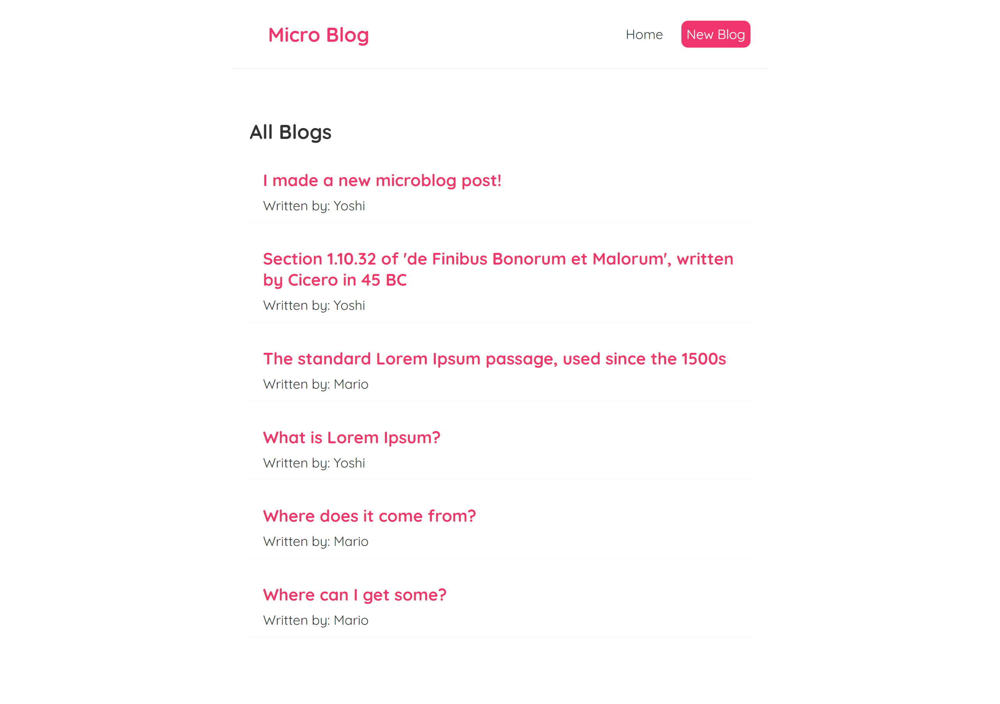
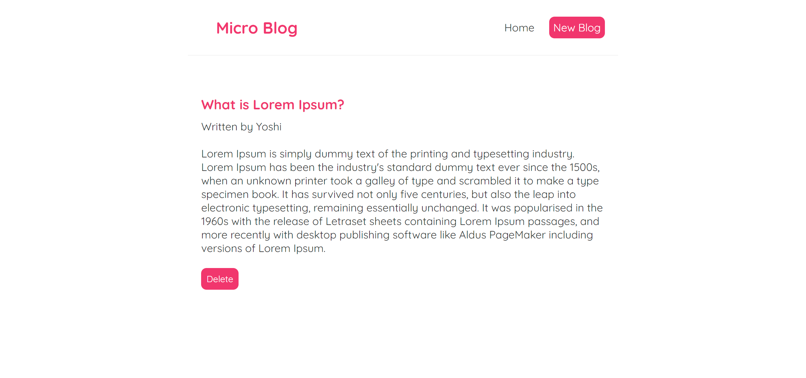
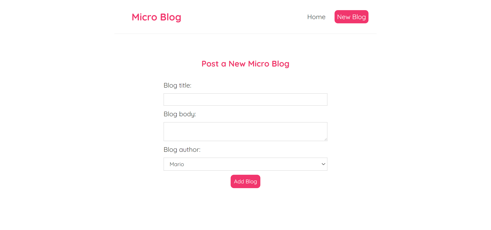
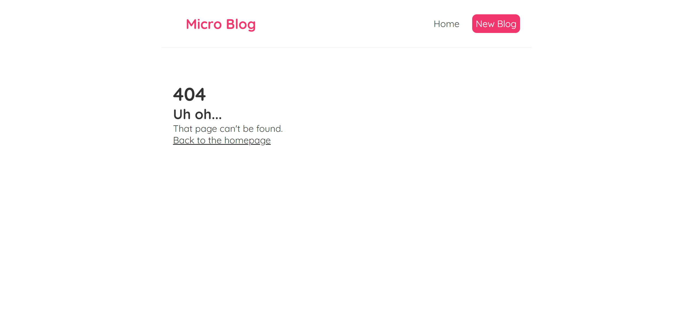

# Microblog - A Fullstack MERN App built with React, Node.js, Express.js, MongoDB and Mongoose

Microblog is a fullstack MERN app that allows for submitting, as might be expected, microblog posts. It was based on the '[Full Modern React Tutorial](https://www.youtube.com/playlist?list=PL4cUxeGkcC9gZD-Tvwfod2gaISzfRiP9d)' and then modified to replace the json-server pseudo-database to a full MongoDB. Thus it has it's own node server. More details can be found in the [server folder](https://github.com/DavidTunnell/microblog-react-router-mongodb-mongoose-node-express/tree/main/server).

[A live demo can be found here.](https://sheltered-river-02202.herokuapp.com/)

It has the following features and functionality.

-   Independent [React](https://reactjs.org/) components and sub-components for the navbar, homepage, 404 page, create, list and view details of microblogs
-   View all created posts on the homepage
-   Create new microblog posts
-   See the details of a post
-   Delete an existing post
-   Dynamic interactivity with React based click and load events
-   Usage of state for data, user entry, API data loading feedback and more
-   UseEffect React data loading and custom hook creation
-   Utilization of AbortController to prevent errors based on user entry
-   API error handling on both client and server side
-   Dynamic URL routing via [react-router-dom](https://www.npmjs.com/package/react-router-dom)
-   Data persistence using [MongoDB](https://www.mongodb.com/) and [MongoDB](https://www.mongodb.com/)
-   Serves the React front end application via build folder
-   Connects to a MongoDB NoSQL database for data persistence
-   Models, connects and interacts with data/database using Mongoose
-   Provides an API for CRUD operations to the database server for the react application
-   Seed functionality to populate the collection with documents
-   Nodemon for more pleasant development

This project uses the following technologies/libraries.

-   [React](https://reactjs.org/) as a Fast and Powerful Frontend
-   [Create-React-App](https://github.com/facebook/create-react-app) for project bootstrapping
-   [React-Router-Dom](https://www.npmjs.com/package/react-router-dom) for URL routing, URL parameters, Browser History Stack Usage, and Linking without Calling the Server
-   [Node.js](https://nodejs.org/en/) and [Express.js](https://expressjs.com/) as the Server for API and HTTP Requests and Serving the React Build Directory Frontend
-   [MongoDB](https://www.mongodb.com/) as a NoSQL Database
-   [Mongoose](https://mongoosejs.com/) for [Object Relational Mapping](https://en.wikipedia.org/wiki/Object%E2%80%93relational_mapping), Database Interaction, [Routing](https://expressjs.com/en/guide/routing.html) and Collection Generation and Seeding

## Installation

This repo consists of two independent projects that, for development at least, need to be setup separately. After cloning the repo to your system, run `npm i` at the project root to get the node project dependencies for the react project and then update the file `.env.EXAMPLE` to `.env` and change any settings if necessary. For development purposes use the command `npm run start-client` as `npm start` has a more complex script used for deployment. The application will be available by default at `http://localhost:3000/` if you are using a local development environment.

Then in a separate terminal navigate to the server folder. This project folder will need its own independent running of `npm install` to get node_module dependencies. Rename .`env.EXAMPLE` to `.env` so that the database name is available for local development. It's assumed you already have MongoDB running on your development computer. Run `npm run seed` in this folder to seed the database. As is present in the script section of `package.json` there are several other available commands as well. `npm run start` will start the server but for development `npm run dev` is recommended.

As far as deploying, the react project (root directory) contains the start command needed to both build the react app and run the node server. However, it may not be easily accessible so the following two commands should be run via Heroku or other cloud server provider. First run npm run `post-install-server` to install the servers node modules and then `post-install-seed` to seed the database.

## API Calls

Followed are the available API calls which are completely independent of the front end. If this is deployed replace `http://localhost:8000` with the correct domain information.

-   GET - http://localhost:8000/api/blogs/ - Get all microblogs
-   GET - http://localhost:8000/api/blogs/id - Get a specific microblog by id
    -   Example return:
    ```
        {
            "_id": "6168c32df1af5d117bfa154b",
            "createdAt": "2021-10-12T23:54:21.147Z",
            "title": "The standard Lorem Ipsum passage, used since the 1500s",
            "body": "Lorem ipsum dolor sit amet, consectetur adipiscing elit, sed do eiusmod tempor incididunt ut labore et dolore magna aliqua. Ut enim ad minim veniam, quis nostrud exercitation ullamco laboris nisi ut aliquip ex ea commodo consequat. Duis aute irure dolor in reprehenderit in voluptate velit esse cillum dolore eu fugiat nulla pariatur. Excepteur sint occaecat cupidatat non proident, sunt in culpa qui officia deserunt mollit anim id est laborum.",
            "author": "Mario"
        }
    ```
-   DELETE - http://localhost:8000/api/blogs/id - Delete a specific microblog by id
-   POST - http://localhost:3001/api/feeds/ - create a new microblog

    -   Body JSON example:

    ```
        {
            "title": "Example title",
            "body": "Example details.",
            "author": "Mario"
        }
    ```

## Screenshots

### Homepage



### Post Details



### Create Microblog



### 404 Not found


